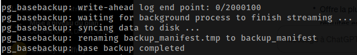
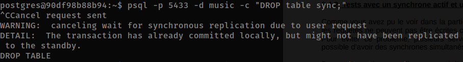

# PostgreSQL - Streaming replication

Cette documentation vous guidera à travers le processus de mise en place d'une réplication en streaming entre les instances PostgreSQLs à l'aide de la commande **psql**. Cette documentation est basée sur le TP de l'UE BDA.

Dans l'objectif d'aborder les problématiques **cloud native**, nous avons choisi d'utiliser **Docker** et **Kubernetes** pour la mise en place de l'infrastructure.

## Table des matières

- [PostgreSQL - Streaming replication](#postgresql---streaming-replication)
  - [Table des matières](#table-des-matières)
  - [I)   Docker Compose](#i---docker-compose)
    - [1. Instance creation](#1-instance-creation)
    - [2. Configuration](#2-configuration)
      - [2.1. Primary instance (pg0)](#21-primary-instance-pg0)
    - [2.2. Secondary instance](#22-secondary-instance)
    - [3. Verification](#3-verification)
      - [3.1. Process verification](#31-process-verification)
      - [3.2. Log verification](#32-log-verification)
    - [4. Testing replication](#4-testing-replication)
      - [4.1. Write and read test](#41-write-and-read-test)
    - [5. Monitoring](#5-monitoring)
      - [5.1. From primary instance](#51-from-primary-instance)
      - [5.2. From secondary instance](#52-from-secondary-instance)
    - [DEBUT DES QUESTIONS:](#debut-des-questions)
    - [6. Promotion](#6-promotion)
      - [6.1. Promotion of the secondary instance](#61-promotion-of-the-secondary-instance)
      - [6.2. Reconfiguration of the primary instance as secondary](#62-reconfiguration-of-the-primary-instance-as-secondary)
    - [7. Configuration as synchronous streaming replication](#7-configuration-as-synchronous-streaming-replication)
      - [7.1. Configuration of new secondary instances](#71-configuration-of-new-secondary-instances)
      - [7.2. Configuration of synchronous replication](#72-configuration-of-synchronous-replication)
      - [7.3. Tests](#73-tests)
    - [Bonus : utilisation du QUORUM](#bonus--utilisation-du-quorum)
    - [8. Analyse des slots de réplication](#8-analyse-des-slots-de-réplication)
      - [8.1. Analyse des fichiers WAL](#81-analyse-des-fichiers-wal)
  - [II)  Kubernetes](#ii--kubernetes)
  - [1. Première approche](#1-première-approche)
    - [1.1 Le « StatefulSet »](#11-le--statefulset-)
    - [1.2 Le « ConfigMap »](#12-le--configmap-)
    - [1.3 Le « Headless Service »](#13-le--headless-service-)
    - [1.4 Les limites](#14-les-limites)
    - [1.5 Les solutions](#15-les-solutions)
  - [Conclusion](#conclusion)

## I)   Docker Compose

### 1. Instance creation

Depuis le CLI de docker, exécutez la commande suivante pour entrer dans le conteneur psql `pg0` et `pg1`:

```bash
docker exec -it <container_name> sh
```

Installation des dépendances, ces packages nous permettront d'utiliser la commande `ps` pour vérifier le processus et `nano` pour éditer les fichiers de configuration.

```bash
apt update && apt install procps && apt install nano
```

Vous pouvez maintenant créer les instances `pg0` and `pg1` en utilisant la commande suivante:

```bash
pg_createcluster 15 <instance_name>
```

Pour chaque instance, vous pouvez démarrer et vérifier l'état de l'instance en utilisant les commandes suivantes:

```bash
pg_ctlcluster 15 <instance_name> start
pg_ctlcluster 15 <instance_name> status
```

Le résultat devrait être comme ci dessous:


### 2. Configuration

#### 2.1. Primary instance (pg0)

Executer la suite depuis l'utilisateur `postgres`:

```bash
su - postgres
```

Créer un utilisateur `repluser` avec les privilèges de réplication:

```bash
$ createuser repluser -p 5433 -P --replication
```

Créer un slot de réplication nommé `pg1_slot` :

**Note**: la commande ci-dessous retourne le resultat de la fonction `pg_create_physical_replication_slot` qui est `pg1_slot` dans notre cas.

```bash
$ psql -p 5433 -c "SELECT * FROM pg_create_physical_replication_slot('pg1_slot');"
```

Depuis l'instance `pg1` en tant qu'utilisateur postgres, créez un fichier `.pgpass` pour stocker le mot de passe de l'utilisateur `repluser` :

```bash
$ echo "pg1:5433:replication:repluser:replication" > ~/.pgpass
$ chmod 600 ~/.pgpass
```

Depuis l'instance `pg0` en tant qu'utilisateur postgres, ajoutez les configurations suivantes dans le fichier `/etc/postgresql/15/pg0/postgresql.conf`:

```bash
listen_addresses = '*'
wal_level = replica
max_wal_senders = 10
wal_sender_timeout = 60s
max_replication_slots = 10
```

Vous pouvez maintenant ajouter la configuration suivante dans le fichier `/etc/postgresql/15/pg0/pg_hba.conf`:

```bash
host replication repluser 0.0.0.0/0 md5
```

**Note**: Dans notre cas comme nous utilisons docker, nous avons utilisé `0.0.0.0/0` pour autoriser toutes les adresses IP à se connecter. Dans un environnement de production, il est recommandé de spécifier l'adresse IP de l'instance secondaire.

Vous pouvez maintenant redémarrer l'instance `pg0` pour appliquer les changements:

```bash
service postgresql restart
```

### 2.2. Secondary instance

Maintenant que la configuration de l'instance primaire est terminée, nous pouvons passer à la configuration de l'instance secondaire `pg1`.

**Note**: Comme nous utilisons docker, nous avons utilisé l'adresse IP de l'instance primaire `pg0` pour la configuration de l'instance secondaire `pg1`.

Entant qu'utilisateur `postgres`, vous pouvez maintenant specifier la configuration du serveur primaire dans le fichier `/etc/postgresql/15/pg1/postgresql.conf`:

```bash
primary_conninfo = 'host=pg0 port=5433 user=repluser passfile=/var/lib/postgresql/.pgpass
sslmode=prefer sslcompression=1'
primary_slot_name = 'pg1_slot'
hot_standby = on
wal_receiver_timeout = 60s
```

Vous pouvez maintenant STOPER l'instance secondaire `pg1` pour appliquer les changements:

```bash
service postgresql stop
```

Supprimez le contenu du répertoire de données de l'instance secondaire `pg1` :

```bash
$ rm -rf /var/lib/postgresql/15/pg1/*
su - postgres
```

Puis appliquez la sauvegarde de l'instance primaire `pg0` sur l'instance secondaire `pg1` :

```bash
$ pg_basebackup -h pg0 -p 5433 -D /var/lib/postgresql/15/pg1/ -U repluser -v -P -X stream -c fast
```

Sortie de la commande:



Configurer l'instance `pg1` comme instance secondaire, mode `standby`, puis redémarrer l'instance:

```bash
$ touch /var/lib/postgresql/15/pg1/standby.signal
$ service postgresql restart
```

### 3. Verification

#### 3.1. Process verification

Pour controller si les processus `walreceiver` et `walsender` sont en cours d'exécution, vous pouvez utiliser la commande suivante:

```bash
ps aux | grep -E 'walsender | walreceiver'
```

Depuis l'instance `pg0` vous devriez voir le processus `walsender` en cours d'exécution:

```bash
postgres     480  0.0  0.0 218532 12564 ?        Ss   17:25   0:00 postgres: 15/pg0: walsender repluser 172.26.0.3(41166) streaming 0/3000148
```

Depuis l'instance `pg1` vous devriez voir le processus `walreceiver` en cours d'exécution:

```bash
postgres     437  0.0  0.0 217352 13716 ?        Ss   17:25   0:00 postgres: 15/pg1: walreceiver streaming 0/3000148
```

#### 3.2. Log verification

Vous pouvez aussi vérifier les logs pour voir si la réplication fonctionne correctement. Depuis l'instance `pg1`, vous pouvez utiliser la commande suivante pour vérifier le log:

```bash
tail -n 100 /var/log/postgresql/postgresql-15-pg1.log
```

La sortie devrait ressembler à ceci:


### 4. Testing replication

Pour tester la réplication, vous pouvez créer une table à partir de l'instance primaire `pg0` et vérifier si la table est créée dans l'instance secondaire `pg1`.

Créez une base de données `music` à partir de l'instance primaire `pg0` (voir les données du TP)

```bash
$ psql -p 5433 -c "create database music;";
```

Depuis l'instance secondaire `pg1`, vous pouvez vérifier si la base de données `music` a bien été créée:

```bash
$ psql -p 5433 -d music -c "\dt"
```

La sortie devrait ressembler à ceci:


#### 4.1. Write and read test

Pour être sûr qu'il est impossible d'écrire sur l'instance secondaire `pg1`, vous pouvez essayer de créer une table dans la base de données `music` depuis celle-ci:

```bash
 psql -p 5433 -c "create database write;"
```

La sortie devrait ressembler à ceci:


Essayons maintenant de lire les données de la table `artists` depuis l'instance secondaire `pg1`:

```bash
 psql -p 5433 -d music -c "select * from artists;"
```

La sortie devrait ressembler à ceci:


### 5. Monitoring

#### 5.1. From primary instance

La réplication peut être monitoré à partir de l'instance primaire en utilisant la commande suivante:

```bash
$ psql -p 5433 -x  -c "select * from pg_stat_replication;"
```

#### 5.2. From secondary instance

Depuis l'instance secondaire, les métriques de réplication peuvent être surveillées en utilisant la commande suivante:

```bash
$ psql -p 5433 -x -c "select * from pg_stat_wal_receiver;"
```

### DEBUT DES QUESTIONS:

> Comparez les informations sur la réplication avec celles observées sur le primaire.
> Que remarquez-vous ?

Ce que nous remarquons c'est que les informations sur la réplication concordent avec le primaire et le secondaire. On remarque que la derniere version du WAL envoyé est la même que celle reçue.

> Affichez les métriques de réplication du serveur primaire et secondaire. Observez les informations de réplication. Que remarquez-vous ? Que pouvez-vous en déduire ?

Ce que nous remarquons c'est la version du WAL a changé et a bien été mise à jour et reçue par le secondaire. Nous remarquons aussi que que la propriété `last_msg_send_time*` a bien été mise à jour avec la derniere la derniere insertion effectuée.


> Calculez la quantité de données transmises entre les instances `pg0` et `pg1` depuis le début de la réplication.

Pour calculer la quantité de données transmises entre les instances `pg0` et `pg1` depuis le début de la réplication, nous pouvons utiliser la requête suivante:

```sql
 psql -c "select pg_wal_lsn_diff('0/71DF760','0/3000000');"
```

Total data transmis: **69072736 octets**

> Listez les lots de réplication et observer les valeurs « active » et « restart_lsn » pour le slot pg1_slot. Que remarquez-vous ?

On remarque que le slot `pg1_slot` est actif avec une valeur `t` (qui signifie true) et que la valeur `restart_lsn` correspond à la dernière position du WAL envoyé qui est la version qui sera utilisée en cas de redémarrage.

On remaque aussi que le "sender" correspond bien à la valeur `pg0` qui est le serveur primaire.

### 6. Promotion

#### 6.1. Promotion of the secondary instance

Pour promouvoir l'instance secondaire `pg1` en tant que serveur primaire, vous pouvez utiliser la commande suivante:

```bash
$ pg_ctlcluster 15 pg1 promote
```

> La requête abouti-t-elle ? Qu’en déduisez-vous ? Affichez les logs de l’instance pg1 (dans /var/log/postgresql/postgresql-15-pg1.log) et
> montrez que la promotion a eu lieu. Vérifiez également l’emplacement dans le WAL.Tentez de créer une nouvelle table dans la base « music » depuis l’instance pg1 avec la requête suivante :

On remarque que la requête abouti et que le serveur secondaire a bien été promu en serveur primaire. On note aussi qu'il est maintenant possible d'écrire sur le serveur `pg1` qui a été promu en serveur primaire.


#### 6.2. Reconfiguration of the primary instance as secondary

> Affichez les logs de l’instance pg0 (/var/log/postgresql/postgresql-15-pg0.log) et montrez qu’elle est bien passé en instance secondaire (ou « standby »).

Depuis les logs de l'instance `pg0`, on remarque que le serveur a bien été reconfiguré en serveur secondaire : `entering standby mode`. De plus, on remarque egalement en listant les processus que le processus `walsender` a bien été arrêté pour laisser place au processus `walreceiver`.


> Analysez les métriques de réplication sur `pg1` et `pg0`. Les deux instances se trouventelles au même emplacement dans le WAL ?

On note que les deux instances se trouvent au même emplacement dans le WAL. On remarque que la dernière version du WAL envoyé est la même que celle reçue. On en déduit que les deux instances sont bien synchronisées.


Apres avoir créé une nouvelle table dans la base `music` depuis l'instance `pg1`, on remarque que la table a bien été créée et synchronisée sur l'instance `pg0`.


### 7. Configuration as synchronous streaming replication

#### 7.1. Configuration of new secondary instances

> Montrez que les deux nouveaux secondaires sont bien reliés au primaire.

Depuis la commande :

```bash
psql -p 5433 -x -c "select application_name, state, sent_lsn, write_lsn, flush_lsn, replay_lsn, sync_state from pg_stat_replication;"
```

On remarque que les deux nouveaux secondaires sont bien reliés au primaire. On remarque aussi qu'ils sont tous en mode `async`. C'est à dire que chaque transaction est repliquée de manière asynchrone.


#### 7.2. Configuration of synchronous replication

> Montrez que l’instance sync2 est devenue une instance synchrone

Après avoir configuré l'instance `pg2` en tant que serveur synchrone, on remarque que l'instance `pg2` est bien devenue une instance synchrone.


> Essayez de créer une nouvelle table dans la base de données music avec la requête ci-dessous. Que se passe-t-il ?

Après avoir essayé de créer une nouvelle table dans la base de données `music` depuis l'instance `pg1`, on remarque que la requête abouti et que la table a bien été créée.

> Essayez de faire la même chose, mais cette fois-ci en arrêtant au préalable l’instance pg2. Que se passe-t-il ?

Après avoir arreté l'instance `pg2` et essayé de créer une nouvelle/supprimer la table dans la base de données `music` depuis l'instance `pg1`, on remarque que la requête n'abouti pas directement mais que la transaction a été commitée seulement localement (apres avoir annulé la transaction manullement ctrl+c). On peut supposer qu'une requete client dans un environnement de production aurait été bloquée jusqu'à ce que l'instance `pg2` soit redémarrée.



Une fois l'instance `pg2` redémarrée, on remarque que la transaction a bien été répliquée sur l'instance `pg2`. On peut justifier cela en testant la commande suivante depuis l'instance `pg2` aprer avoir redémarré:


> Listez les instances connectées au serveur primaire. Quel est l’état de sync2 ? Quel est l’état de sync3 ?

Après avoir listé les instances connectées au serveur primaire, on remarque que l'instance `pg0` est bien en mode `sync` et que l'instance `pg3` quant à elle est en mode `potential`. Cela signifie que l'instance `pg3` est en attente de devenir une instance synchrone (instance de secours). La propriété `FIRST 1` definie la premiere instance déclarée comme etant obligatoire pour la synchronisation, rendant ainsi l'instance `pg3` dans un etat `potential`.


> Créez une nouvelle table dans la base de données music avec la commande cidessous, La requête aboutit-elle ? La nouvelle table est-elle présente sur sync3 ?

La requete aboutit et la table est bien présente sur l'instance `pg3`.

> Arrêtez sync3 et essayez de créer une nouvelle table dans la base music. L’arrêt du potentiel empêche-t-il l’exécution des requêtes ?

On peut constater que la requete s'execute normalement sans erreur ou warning d'exécution.

> Redémarrez sync3 et arrêtez sync2. Que remarquez-vous sur l’état de sync3 ? Qu’en déduisez-vous ?

On remarque que l'instance `pg3` est bien devenue une instance synchrone. On en deduit donc que l'arret de l'instance `pg2` a permis à l'instance `pg3` de devenir une instance synchrone de remplacement.


> Dans /etc/postgresql/15/pg1/postgresql.conf, passez à deux synchrones simultanés en passant la valeur 1 à 2 à la ligne synchronous_standby_names comme ci-dessous : `synchronous_standby_names = 'FIRST 2 (sync2,sync3)'`
> Redémarrez l’instance pg1 pour appliquer les changements.
> Quel est maintenant l’état de sync3 ?

On remarque que l'instance `pg3` est bien devenue une instance synchrone, cela s'explique par la propriété `FIRST 2` ajouté précedemment qui defini les deux premieres instances déclarées comme etant obligatoires pour la synchronisation.

#### 7.3. Tests

> Arrêtez sync3 (pg3). Que se passe-t-il si vous essayez de créer une nouvelle table dans la base de données music ? Redémarrez ensuite sync3. La requête aboutit-elle ? Que pouvez-vous en déduire ?

Tout comme la question précédente, on remarque que la requete s'execute mais retourne cependant des **warnings** d'exécution.

```
psql -p 5433 -d music -c "create table syncronTest(id integer);"
WARNING:  canceling wait for synchronous replication due to user request
DETAIL:  The transaction has already committed locally, but might not have been replicated to the standby.
CREATE TABLE
```

Apres avoir redémarré l'instance `pg3`, on remarque que la transaction a bien été répliquée .

```
postgres@cf932b694ba1:~$  psql -p 5433 -d music -c "select * from syncronTest;"
 id
----
(0 rows)
```

### Bonus : utilisation du QUORUM

> Observez l’état des serveurs et montrez que les trois instances secondaires font désormais partie du quorum.

On remarque que les trois instances secondaires font désormais partie du quorum. Le mot-clé `ANY`, utilisé avec `synchronous_standby_names`, spécifie une réplication synchrone basée sur un quorum, si bien que chaque validation de transaction attendra jusqu'à ce que les enregistrements des WAL soient répliqués de manière synchrone sur au moins `synchronous_standby_names` des serveurs secondaires listés.


> Arrêtez sync3 et essayez de créer de nouveau une table dans la base music. Que se passe-t-il ? Que pouvez-vous en déduire sur le rôle du quorum ?

On remarque que la requete s'execute normalement sans erreur ou warning d'exécution. On peut en déduire que le quorum permet de garantir la disponibilité des données en cas de panne d'une instance secondaire, synchrone.


### 8. Analyse des slots de réplication

#### 8.1. Analyse des fichiers WAL

> Listez le contenu de /var/lib/postgresql/15/pg1/pg_wal


> Listez de nouveau le contenu du dossier pg_wal et comparez le résultat à celui de la question. Que pouvez-vous observer comme différences ? (regardez notamment la date et l’heure de dernière modification des fichiers)? Que pouvez-vous déduire des résultats observés ci-dessus ?

Après avoir listé de nouveau le contenu du dossier `pg_wal`, on remarque que la date et l'heure de dernière modification des fichiers ont changé : `Feb  7 16:08` avant insertion et `Feb  8 11:57` après insertion. Ainsi, on peut en déduire que les fichiers ont été correctement mis à jour sur au moins 2 des 3 instances secondaires.


Depuis l'instance secondaire `pg2`, on peut vérifier que les fichiers ont bien été répliqués en cherchant si la base de données `testwal` est bien présente.


Après avoir lancé la commande : `psql -p 5434 -c 'CHECKPOINT;'`

> Lister de nouveau le contenu du dossier pg_wal. Quels changements pouvez-vous observer par rapport aux résultats précédents ? Que pouvez-vous déduire de ces observations ?

Après le "CHECKPOINT" on remarque que la valeur hexadécimale des fichiers composant le WAL a changé. On peut en deduire que la fonction `CHECKPOINT` a été correctement exécutée.

Il est important de noter que la fonction `CHECKPOINT` force une écriture des données sur le disque sans attendre le CHECKPOINT régulier planifié par le système. De plus il force la réécriture des fichiers WAL, comme fichiers de démarrage pour les futures transactions. Cette commande ne s'utilise generalement pas dans un environnement de production.


> Arrêtez l’instance pg2, créez une nouvelle table dans la base « testwal » et y insérer des données. Observez l’état des fichiers WAL et montrez que les données y ont bien été écrites.

Après avoir arrêté l'instance `pg2` et créé une nouvelle table dans la base `testwal` depuis l'instance `pg1`, on remarque que l'heure de dernière modification des fichiers WAL a bien changé. On peut en deduire que les données ont bien été repliquées.


> Observez l’état des fichiers WAL. Les fichiers ont-ils été recyclés ? Pourquoi ?

Nous constatons que les fichiers n'ont pas été recyclés. Cela s'explique par le fait que l'instance `pg2` est en mode `async` et que les données n'ont pas encore été répliquées sur l'instance `pg2, bloquant ainsi le recyclage des fichiers WAL, les conservant en attente dans le slot de réplication.

> Redémarrez pg2 et vérifiez qu’il est bien synchronisé avec le primaire. Vérifiez pour cela les champs LSN sur le primaire et pg2.

Apres avoir redémarré l'instance `pg2`, on remarque que l'instance celle-ci est bien synchronisée avec le primaire. On peut le justifier en comparant les champs LSN sur le primaire `pg1` et le secondaire `pg2`à l'aide des commandes suivantes:

Depuis le secondaire:

```bash
psql -p 5433 -x -c "select * from pg_stat_wal_receiver;
```

Depuis le primaire:

```bash
psql -p 5433 -x -c "select * from pg_stat_replication;"
```

Ensuite nous pouvons relancer la commande `psql -p 5434 -c 'CHECKPOINT;'` pour vérifier que les fichiers WAL ont bien été recyclés cette fois-ci.

> Observez l’état des fichiers WAL. Les fichiers ont-ils été recyclés ? Pourquoi ?

On remarque que la valeur hexadécimale des fichiers WAL a bien changé. On peut en deduire que les fichiers ont bien été réécris. Cela s'explique par le fait que l'instance `pg2` est bien synchronisée avec le primaire et que les données ont bien été repliquées.

## II)  Kubernetes

Pour aller plus loin, il est intéressant d'examiner l'état de l'art des bases de données relationnelles dans un contexte de mise à l'échelle et de résilience dans l'un des technologies les plus prisés aujourd'hui : *Kubernetes*.

Il est indispensable pour des entreprises telles que Zalando ou Amazon de disposer d'une base de données hautement disponible. Cela nécessite des fonctionnalités de résilience, de mise à l'échelle dynamique et de reprise après sinistre.

Les défis liés à la réplication des données tout en garantissant un état cohérent peuvent être particulièrement complexes à résoudre. Nous allons explorer ces aspects en détail.

Les manifestes Kubernetes pour le déploiement du cluster PostgreSQL sont accessibles dans le dossier [manifests](./manifests/).

## 1. Première approche

Il est souvent souligné que le déploiement de systèmes de gestion de base de données relationnelle (RDBMS) dans un cluster Kubernetes en haute disponibilité peut être très complexe. Mais pourquoi est-ce le cas ? Une des solutions populaires pour PostgreSQL consiste à utiliser un opérateur Kubernetes. L'un des opérateurs les plus reconnus est celui développé par Zalando, disponible sur [GitHub](https://github.com/zalando/postgres-operator).

Dans le cadre de notre TP, nous allons tenter de déployer cette solution dans Kubernetes en exploitant au maximum les ressources natives de la plateforme.

### 1.1 Le « StatefulSet »

StatefulSet est l'objet de l'API de charge de travail utilisé pour gérer les applications avec état. Il gère le déploiement et la mise à l'échelle d'un ensemble de Pods et fournit des garanties sur l'ordre et l'unicité de ces Pods.

Le modèle de conception du StatefulSet suit une logique maître/esclave, ce qui se révèle particulièrement pertinent dans notre cas, notamment pour la gestion de PostgreSQL et de sa réplication. Nous avons ainsi une base de données principale (primaire) et des bases de données de secours (standby). 

Dans cette configuration :
- l'index 0 du StatefulSet représente notre base de données principale
- les index supérieurs à 0 correspondent aux serveurs standby.
  
Vous pouvez consulter le manifeste [statefulset.yaml](./manifests/statefulset.yaml) pour plus de détails.

### 1.2 Le « ConfigMap »

Un ConfigMap est un objet API utilisé pour stocker des données non confidentielles dans des paires clé-valeur. Les pods peuvent consommer des ConfigMaps en tant que variables d'environnement, arguments de ligne de commande ou fichiers de configuration dans un volume. Il vous permet de découpler la configuration spécifique à l'environnement de vos images de conteneur, afin que vos applications soient facilement portables.

Dans notre cas, le ConfigMap joue un rôle essentiel pour monter des scripts d'initialisation de la réplication dans le répertoire **docker-entrypoint-initdb.d** du conteneur PostgreSQL. Cela est spécifié dans le manifeste [configmap.yaml](./manifests/configmap.yaml).

Lors de l'initialisation, il est crucial que le script d'initialisation détecte l'index du pod afin de déterminer s'il doit exécuter le script "primary" ou "standby". Pour ce faire, nous utilisons une fonction bash comme celle-ci :

```bash
get_ordinal() {
  if [[ $(hostname) =~ -([0-9]+)$ ]]; then
      echo "${BASH_REMATCH[1]}"
  else
      exit 1
  fi
}
```

Cette fonction extrait l'index du nom d'hôte du pod, ce qui permet de distinguer les pods principaux des pods standby et de prendre les mesures appropriées en fonction de leur rôle dans le cluster PostgreSQL.

### 1.3 Le « Headless Service »

Un « headless service » dans Kubernetes peut être un outil utile pour créer des applications distribuées. Il vous permet d'accéder directement aux différents pods d'un service. Cela est utile dans les scénarios où vous devez effectuer un équilibrage de charge complexe.

Une fois que vous avez créé un service "sans-tête", vous pouvez accéder à chaque pod associé au service par le biais du DNS. L'enregistrement DNS de chaque pod sera au format :
**\<pod-name>.\<headless-service-name>.\<namespace>.svc.cluster.local**

Ce type d'enregistrement DNS sera particulièrement utile pour accéder au pod portant l'index 0, représentant ainsi le serveur primaire, ainsi qu'aux autres pods dans le cluster. Dans le script d'initialisation, les hôtes suivants sont utilisés :

- postgres-cluster-0.postgres-cluster.postgres.svc.cluster.local
- postgres-cluster-1.postgres-cluster.postgres.svc.cluster.local

Le service sans-tête correspondant est disponible dans le fichier [service.yaml](./manifests/service.yaml).

### 1.4 Les limites

Le processus de démarrage initial du cluster PostgreSQL et de sa réplication fonctionne de manière optimale dans Kubernetes. Cependant, qu'en est-il si, par exemple, le pod à l'index 1 est promu en tant que serveur principal ? Dans un tel cas, comment assurer que le service pointe désormais vers le nouveau serveur principal ? Pour un scénario de récupération après sinistre, il est impératif que chaque pod PostgreSQL soit conscient des autres, ce qui implique une initialisation synchronisée. Dans ce contexte, la garantie d'ordre offerte par le StatefulSet et la résolution DNS offerte pas le headless service perdent de leurs utilités.

Dans les scripts d'initialisation actuels, les DNS sont délibérément codés en dur pour le serveur principal et les serveurs standby. Cette approche pose des défis en termes de flexibilité et de gestion des changements dynamiques au sein du cluster.

Ainsi, il devient de plus en plus évident que la gestion continue du cluster nécessite des actions manuelles. Des compétences avancées sont obligatoires, non seulement en ce qui concerne Kubernetes, mais également en ce qui concerne PostgreSQL.

### 1.5 Les solutions

Les indices du StatefulSet conservent leur utilité, mais le bootstrap ordonné devient obsolète. Par conséquent, le paramètre "podManagementPolicy" du StatefulSet doit être configuré sur "Parallel". Le service headless n'est plus pertinent dans ce contexte, donc nous devons revenir à deux services de type ClusterIP : l'un pour le server primaire et l'autre pour l'ensemble des instances. Nous devons également gérer dynamiquement l'endpoint du service destiné au priamire, pour le mettre à jour à chaque nouvelle promotion. Ces considérations nous mènent inévitablement à l'utilisation d'un orchestrateur.

En plongeant dans les détails, il devient de plus en plus évident qu'il est impératif d'utiliser un opérateur pour gérer efficacement ces scénarios complexes.

## Conclusion

En conclusion de ce TP, la mise en place réussie d'une réplication en streaming entre les instances PSQL, avec la configuration des serveurs primaire et secondaire (pg0 et pg1), ainsi que des serveurs secondaires synchrone puis asynchrone, a permis d'explorer le fonctionnement des slots de réplication et l'impact de la fonction CHECKPOINT sur les fichiers WAL.

Cependant, il est important de souligner que cette solution s'avère difficilement implémentable pour un modèle cloud natif tel que Kubernetes. La gestion complexe du fail-over est un défi notable, bien que des solutions existent, notamment à travers des opérateurs Kubernetes comme celui proposé par Zalando.

En dépit des difficultés rencontrées, ce TP a été enrichissant, offrant des perspectives éclairantes sur les choix à considérer dans des projets futurs. L'expérience acquise souligne l'importance de prendre en compte les spécificités des environnements cloud natifs et des solutions dédiées pour garantir une mise en œuvre efficace de la réplication dans des contextes tels que Kubernetes.
